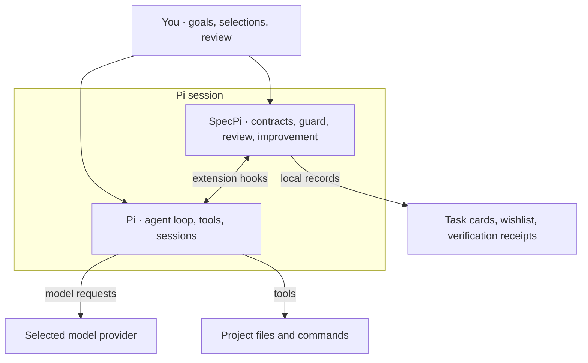

<p align="center">
  
</p>

<h1 align="center">SpecPi</h1>

<p align="center">
  A local, human-directed improvement harness for the
  <a href="https://pi.dev/">Pi coding agent</a>.
</p>

<p align="center">
  <a href="#install"><strong>Install</strong></a>
  · <a href="#included-capabilities">Capabilities</a>
  · <a href="#improvement-loop">Improvement loop</a>
  · <a href="https://tannermidd.github.io/SpecPi/">Website</a>
  · <a href="https://tannermidd.github.io/SpecPi/wiki/">Wiki</a>
  · <a href="SECURITY.md">Security</a>
</p>

## Purpose

SpecPi adds task contracts, workflow controls, and a local improvement loop to Pi. It records recurring capability gaps and presents qualified items for human review. Selecting one exact item with `/harness-improvement` authorizes a bounded change; repository checks and capability-specific validators must pass before it can retire.

Collection is disabled until explicitly enabled. Reports are sanitized, bounded, deduplicated by task, and never uploaded. Later evidence can reopen an item for review, but never restarts implementation automatically.

Version `0.12.0` adds experimental native delegation and a new technical site. Task cards, verification receipts and human outcome assessments remain part of the single-agent workflow. See the [release notes](CHANGELOG.md) for the change list.

## Optional delegation

The native extension creates actual Pi `AgentSession` subagents while the parent remains the sole writer. Use normal `pi` startup and the existing SpecPi install/update lifecycle. Delegation starts disabled, with its tool schema absent from model requests; human `/delegate on` enables the displayed envelope and `/delegate off` revokes outstanding work. Delegation checks required public SDK capabilities rather than an exact Pi version list, so compatible Pi updates do not require a SpecPi release. The installer bootstrap remains pinned to 0.84.4, and runtime validation is recorded separately.

Only `review` of a frozen artifact and `scout` analysis of a bounded evidence question are supported. Both can list, read and search exact selected text snapshots. Children have in-memory sessions and no ambient extensions, skills, AGENTS files, parent history, shell, writes, recursive delegation or live web access. Each receives assigned requirements and fixed constraints. There are at most two active workers, two jobs per batch, four batches and 32 SDK model invocations per Pi process. Reloads, session switches and off/on preserve counters; cancellation holds slots through SDK-visible stream/result and prompt settlement. Restart Pi to change the fixed working root or load a changed delegation runtime.

Pi owns the agent loop, authentication and OAuth. A fresh child `ModelRuntime` uses standard environment and `models.json` resolution; child transport/thinking budgets come from configured global settings, without project settings. Parent model/thinking are explicit with Pi clamping. Runtime-only authentication, selected extension-provider overrides, model-specific headers, startup proxy configuration and safe descriptor mismatches fail preflight without changing parent setup. Parent hooks, ephemeral settings and session affinity are not inherited. Each SDK invocation is admitted before dispatch; retries and compaction are disabled. SDK-visible streaming checks do not establish raw-transport, hidden-provider-attempt, invoice or memory caps, or prove remote execution has ended. Cost is unavailable. Research supports testing these purposes; no measured SpecPi quality, cost or speed advantage is claimed.

See the [delegation guide](docs/delegation/README.md), [tool protocol](docs/delegation/protocol.md), [research](docs/delegation/research.md), and [evaluation plan](docs/delegation/evaluation.md) for setup, examples, boundaries and evidence.

## Install

Requires **Node.js 22.19+**, **npm**, **Git**, and **Pi 0.84.4+**. If Pi is absent, the confirmed install adds the reviewed pinned package.

Install the CLI, inspect its non-mutating plan, and confirm the managed installation:

```bash
npm install --global specpi@latest
specpi plan
specpi install
specpi doctor
```

`plan` does not mutate the system. Install, update, and uninstall require confirmation unless `--yes` is supplied. Restart Pi after installation or updating SpecPi to load the delegation runtime.

<details>
<summary><strong>Pin a release or install from audited source</strong></summary>

Pin the reusable CLI when installing a reviewed release, or inspect its plan without retaining a global CLI installation:

```bash
npm install --global specpi@0.12.0
npx --package specpi@0.12.0 specpi plan
```

For a source-audited installation, clone the exact release:

```bash
git clone --branch v0.12.0 --depth 1 https://github.com/TannerMidd/SpecPi.git
cd SpecPi
./specpi plan
./specpi install
./specpi doctor
```

On Windows source checkouts, use `.\specpi.cmd` in place of `./specpi`. The npm installation provides the `specpi` command on every supported platform.

</details>

<details>
<summary><strong>Update or uninstall</strong></summary>

Update the npm CLI and its managed installation as two explicit steps:

```bash
npm install --global specpi@latest
specpi update
specpi doctor
```

Uninstall managed SpecPi resources before removing the CLI. Private wishlist, journal, experiment, and patch state remains local unless explicitly removed:

```bash
specpi uninstall
npm uninstall --global specpi
```

</details>

Direct `pi install npm:specpi` loads extensions, skills, and themes only. It does not run the full installer or provide managed instructions, browser runtime dependencies, supporting Pi packages, optional tools, shell integration, backups, or ownership records.

## Included capabilities

### Define and review work

| Interface     | Purpose                                                                                                                                         |
| ------------- | ----------------------------------------------------------------------------------------------------------------------------------------------- |
| `/task`       | Record the objective, fixed requirements, acceptance checks, expected paths, hypothesis, rollback, and non-goals on the current session branch. |
| `/scope`      | Declare expected paths and report unacknowledged drift.                                                                                         |
| `/files`      | Browse source, rendered Markdown, Git diffs, and bounded review comments.                                                                       |
| `/experiment` | Create detached worktrees with keep, binary patch export, and confirmed discard outcomes.                                                       |
| `/challenge`  | Review readiness through structured evidence, gaps, contradictions, and residual risk.                                                          |

### Improve from evidence

| Interface              | Purpose                                                                              |
| ---------------------- | ------------------------------------------------------------------------------------ |
| `/wishlist`            | Store and curate privacy-minimized local capability-gap reports.                     |
| `/harness-improvement` | Select one qualified or review-needed item and authorize its bounded implementation. |

### Work inside Pi

| Interface           | Purpose                                                                                                                               |
| ------------------- | ------------------------------------------------------------------------------------------------------------------------------------- |
| `/spec`             | Replace normal chrome with a technical run panel, seal live reasoning, hold streaming prose until complete, and keep tools collapsed. |
| `/guard`            | Deny confirmed host-wide destructive calls and request approval for bounded risk classes.                                             |
| Browser tools       | Open an isolated Chromium context for rendered inspection and screenshots.                                                            |
| `specpi-spec` theme | Bring blueprint blue, technical greys, layered surfaces, and restrained semantic states into Pi.                                      |
| `specpi` CLI        | Plan, install, update, verify, and uninstall managed state with backups and rollback.                                                 |

`specpi-spec` is the default Pi theme, carrying the site's specification design through message surfaces, tools, Markdown, diffs, syntax highlighting, search, and the full thinking-level scale. **Existing valid theme preferences survive installation and updates.** The original `tea-house` theme remains bundled and selectable from `/settings`.

Capability registry entries include closed offline validators. Completion, `npm run check`, and `specpi doctor` run those validators.

## How SpecPi fits

SpecPi runs inside Pi through extensions, skills, settings, and themes. Pi supplies the agent runtime, tools, sessions, and model connections; SpecPi adds the working agreement, workflow controls, and local improvement loop.



## Work ownership

### Task contracts and handoff

Use `/task set` when a shared contract would improve continuity. Its card supplies fixed requirement IDs to `/challenge` and can seed an experiment's hypothesis and acceptance checks. `/spec` shows the active task. `/scope task` explicitly imports the card's expected paths; recording a card alone never widens scope. Human edits create a new card revision and invalidate a review of the earlier card.

Use `/task clear` before recording an unrelated task. Within a session, repeated reports for the same capability share the card's task ID across agent runs and card revisions. Without a card, report grouping remains per run.

`/task handoff` displays a review packet containing the original card, observed change information, the latest completion review, and unresolved facts. Inspect the packet before sharing it or opening a separate review session. It does not launch another agent or write an export.

### Scope and completion

`/scope set` declares expected paths. `/scope accept <path>` acknowledges one finding without widening the contract. `/scope add <path>` widens it. `/scope recheck` replaces an uncertain baseline.

`/challenge` requires structured requirement evidence and checks for contradictions, false-positive validation, scope drift, missing runtime or visual checks, and residual risk. Its result supports human review and does not replace direct proof.

### Isolated experiments

Use `/experiment start` when an independent review or trial justifies a separate worktree. Open the reported path in another Pi session. SpecPi does not launch an agent, copy dirty base changes, commit, merge, or touch remotes.

SpecPi keeps one writer per working directory. Its experimental delegation adds bounded read-only Pi sessions. A parent determines what context a child receives and verifies what returns, so either handoff can omit a material constraint. Parallel writers also introduce conflicting assumptions and increase review work.

## Improvement loop

1. **Record:** A reusable capability gap is stored as a sanitized local report.
2. **Qualify:** Recurrence, project reach, impact, and recency determine whether the item enters the review menu.
3. **Select:** `/harness-improvement` authorizes one exact item.
4. **Implement:** The `specpi-improve` skill makes the narrowest sufficient change and adds direct checks.
5. **Verify:** The completion gate checks the selected task contract and registry integration, runs `npm run check` and the item's closed validators, and rejects evidence if the checked source changes.
6. **Retire:** A passing item leaves the queue. Its model-reported evidence and executable verification receipt remain separately identified in the local journal.
7. **Review again:** Later evidence returns the item as `review-needed`. Implementation does not restart automatically.

<details>
<summary><strong>View the improvement loop</strong></summary>

<p align="center">
  
</p>

</details>

### Inspect the record

Use `/wishlist status` for queue and loop-health totals. Use `/wishlist history [gap-id]` for retirement evidence, validators, changed files, reopen signals, and rollback context. `/wishlist` also supports duplicate cleanup, local issue drafts, archive, and reset operations.

With collection enabled, `/wishlist outcome <gap-id>` records an explicit human assessment of the latest local retirement: helped, failed, not exercised, or reverted. Later assessments replace the earlier assessment in totals while history retains both. Failure is a reason to review; it never authorizes another implementation. Unused capabilities remain unassessed.

## Command guard

Every supported model-initiated Pi tool call is classified before execution. Select one mode at session start:

| Mode       | Behavior                                                                                                                |
| ---------- | ----------------------------------------------------------------------------------------------------------------------- |
| **Guard**  | Denies confirmed host-wide catastrophe and guard tampering, asks before Git destroys work, and otherwise remains quiet. |
| **Strict** | Adds approval requests for mutation, execution, sensitive reads, and network activity.                                  |
| **Off**    | Requires confirmation and applies only to the current session.                                                          |

Approvals apply to one exact call and one session. Only a structurally proven critical mutation locks the session. Parser uncertainty and invalid cleanup syntax are denied without locking later work.

The guard covers the documented `bash`, `powershell`, `read`, `write`, and `edit` seams. Direct shell escapes, malicious extensions, unclassified custom tools, approved scripts, TOCTOU changes, and external processes remain outside its scope.

## Data and security boundaries

**Local state.** SpecPi does not persist command text or read Pi credentials, unrelated sessions, or history. Scope and challenge records are bounded entries in the current Pi session; task cards are bounded to the active session branch. Wishlist reports, improvement journals, experiment metadata, and exported patches remain in private local SpecPi state and can survive uninstall. Review local artifacts before sharing.

**Verification receipts.** Improvement verification fingerprints supported source and validation inputs, records actual gate results, and detects changes between verification snapshots. Receipts retain hashes and runtime metadata, not source contents or raw command output. They describe what was checked; they are not cryptographic attestations or proof that a model's acceptance explanation is correct. Older journals remain readable and are identified as lacking a receipt.

**Provider and network access.** Local SpecPi evidence does not make the whole agent offline. Pi sends model requests to the selected provider, browser pages and installed packages may contact the network, and Pi has separate telemetry and update-check settings. The installer explains these boundaries without changing those upstream preferences.

**Host permissions.** Pi extensions run with the current user's permissions. Use OS permissions, a least-privilege account, a container, or a VM for hostile code or data. See [SECURITY_MODEL.md](SECURITY_MODEL.md) for the complete trust model and [SECURITY.md](SECURITY.md) for vulnerability reporting.

## Development

```bash
npm install --ignore-scripts --omit=peer --no-package-lock
npm run format
npm run check
```

JavaScript and TypeScript use four-space indentation, explicit braced control flow, and one statement per line. The repository check enforces formatting, validates syntax, runs the Node test suite, executes registry-linked validators, and installs the exact npm tarball through an isolated lifecycle. Maintainers should follow [NPM_RELEASE.md](NPM_RELEASE.md) for release preparation and protected publication.

MIT licensed.
