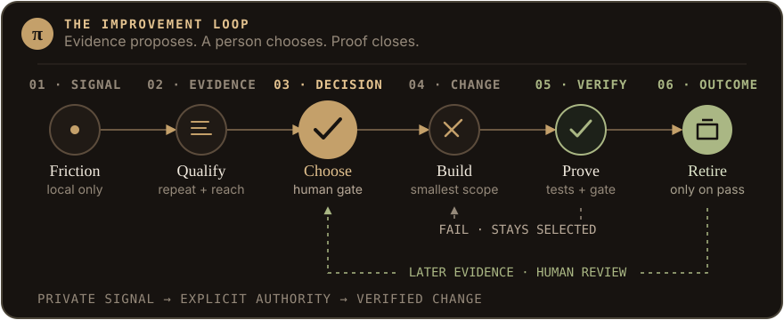

<p align="center">
  
</p>

<h1 align="center">ZenPi</h1>

<p align="center"><strong>Breathe. Then build.</strong></p>

<p align="center">
  A minimal, self-improving harness for the
  <a href="https://pi.dev/">Pi coding agent</a>.
</p>

<p align="center">
  <a href="https://tannermidd.github.io/ZenPi/"><strong>Showcase</strong></a>
  · <a href="#install">Install</a>
  · <a href="SECURITY.md">Security</a>
</p>

---

## Let friction teach the system

Most agent setups grow by accumulation. **ZenPi grows by evidence.**

When a real, reusable capability gap gets in the way, ZenPi records a privacy-minimized local signal, measures recurrence and reach, and gives the human one clear next improvement.

<p align="center">
  
</p>
<p align="center"><a href="https://tannermidd.github.io/ZenPi/#wishlist">Walk one example through the loop</a></p>

The goal is not autonomous self-modification. It is to make the next justified change obvious, testable, reversible, and explicitly approved.

## How the loop works

1. **Observe locally.** Collection is off until explicitly enabled. Reports are sanitized, bounded, deduplicated by task, and never uploaded.
2. **Choose once.** Run `/harness-improvement`. One menu shows qualified and review-needed items; choosing one explicitly authorizes that exact smallest-sufficient improvement and starts the agent workflow.
3. **Change minimally.** The `zenpi-improve` skill inspects the evidence, implements the narrowest intervention, and runs direct acceptance checks.
4. **Verify and retire.** The completion gate verifies registry integration, runs `npm run check` and supported closed validators, then retires the item only when everything passes. Failed checks leave it selected. Later friction returns it to the same review menu.

```text
/harness-improvement
```

`retired` means the capability was integrated and passed its verification gate. `review-needed` means new evidence appeared afterward; choosing it from `/harness-improvement` reopens and selects it automatically.

`/wishlist` remains the local inspection and advanced curation surface. Exact merge/unmerge decisions correct fragmented gap names without rewriting history. Local issue drafts and checksummed archive/reset operations remain explicit and offline.

## What ZenPi adds

- Focused `/zen` execution mode
- Tea House-native `/files` browser, viewer, diffs, and review comments
- Evidence-led capability wishlist
- One-command `/harness-improvement` workflow
- `/zen-subagents` saved exact-provider role profiles and global capacity configuration
- Isolated browser interaction and visual regression checks
- Review-first installation with backups, checksums, and rollback

### Browse and review files

Run `/files` to open the Tea House-native project browser, or `/files <path>` to start in another directory. It uses Pi's built-in syntax and Markdown renderers, with no bat, git-delta, or glow prerequisite.

Inside the browser, use `j`/`k` to move, `Enter` to open, `/` to search, `c` to show changed files, and `r` to refresh. The viewer supports source, rendered Markdown, Git diffs, and `v` line selection followed by `c` to write a review comment; submit it with `Ctrl+Enter`.

### Configure native subagents

Run `/zen-subagents` for one confirmed flow that edits the active exact-provider profile for `scout`, `researcher`, `worker`, `reviewer`, and `oracle`, plus cumulative run/session child budgets and active top-level async capacity that remain global.

Configure each exact Pi provider once. ZenPi restores its saved profile and strict `modelScope` automatically when a later session switches back, then prompts for `/reload` when the startup-loaded runtime mapping changed. `inherit` remains portable. Saved models that are no longer available become stale, remain stored, and are never silently replaced; `openai` and `openai-codex` remain separate boundaries. Simultaneous processes on different providers fail closed instead of racing the shared active mirror.

```text
/zen-subagents
/zen-subagents status
/zen-subagents reset
```

One confirmation atomically applies the provider profile, active settings mirror, and any explicitly edited global capacity while preserving unrelated JSON and creating a bounded leaf-only backup. Reset changes only the active provider profile; other profiles and global capacity remain unchanged. Run `/reload` after ZenPi restores a provider profile or edits startup-loaded role/capacity settings; native launches remain blocked until the refreshed runtime is verified. These settings do not control modern `runs.all` child concurrency.

Trusted project `.pi/settings.json` has higher Pi precedence. ZenPi resolves the effective project from the launch `cwd` and blocks native `subagent` tool launches when that project replaces the managed scope with an unsafe cross-provider policy. File-authored workflows and inline scripts containing a literal child `cwd` are blocked because a config wrapper cannot verify those child projects before `pi-subagents` evaluates the script. Inline JavaScript can dynamically compute child options; such user-authored workflow code, directly administered project configuration, and direct `pi-subagents` commands remain trusted user-controlled boundaries rather than claims ZenPi can sandbox.

## Install

Requires Node.js 22.19+, npm, and Git. ZenPi uses an existing Pi 0.80.0+ installation; when Pi is absent, a confirmed install automatically runs npm to globally install the reviewed `@earendil-works/pi-coding-agent@0.84.3` release with lifecycle scripts disabled. Clone a reviewed release tag rather than piping remote code into a shell.

```bash
git clone --branch v0.6.0 --depth 1 https://github.com/TannerMidd/ZenPi.git
cd ZenPi
```

**Windows**

```powershell
.\zenpi.cmd plan
.\zenpi.cmd install
.\zenpi.cmd doctor
```

**Linux, macOS, or Git Bash**

```bash
./zenpi plan
./zenpi install
./zenpi doctor
```

Installation remains explicit and reversible. The plan and confirmation show Pi bootstrap before any global installation. `--skip-package-install` also disables automatic Pi installation. A Pi installation created by ZenPi is external and remains after ZenPi uninstall. If npm's global executable directory is not already on `PATH`, ZenPi stops with that exact directory and requires it to be added before installation can complete; it never relies on a process-only `PATH` change. Use `--skip-browser-install`, `--skip-package-install`, or `--skip-tool-install` when needed, then run `/reload` in Pi. See [SECURITY.md](SECURITY.md) for dependency, platform, state-retention, and trust details.

## Boundaries

ZenPi does not own or inspect credentials, provider authentication, session content, history, or trust decisions. `/zen-subagents` reads active provider/model identifiers and available scoped model metadata, and stores only exact provider IDs, model IDs, thinking levels, timestamps, and schema metadata in `~/.pi/agent/zenpi/subagent-provider-profiles.json` (or the equivalent `PI_CODING_AGENT_DIR` path). Profiles are retained on uninstall; after stopping Pi, delete that file manually for a complete profile purge. Wishlist evidence alone grants no authority. A person must choose the exact item in `/harness-improvement`; installs, uploads, publishing, and remote-state changes still require separate explicit approval.

Sanitization is bounded defense in depth. Review local wishlist output before sharing it.

## Development

```bash
npm run check
```

MIT licensed.
