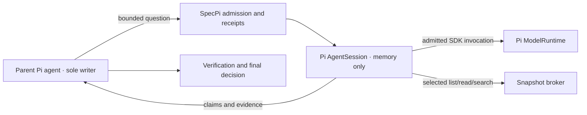

# Bounded delegation

Status: experimental in SpecPi 0.17.0. Enabled by default at Pi startup.
The package remains `specpi`; no separate npm package or background service is required.

SpecPi keeps one agent responsible for changes and acceptance. This extension adds
bounded, read-only workers for independent questions. It does not add a second writer,
an automatic planner, or a permanent team. The [research](research.md) supports testing
selective delegation; it does not establish that this implementation improves outcomes.

## Use normal Pi startup

```sh
pi
```

The native extension is discovered through the ordinary Pi package and SpecPi
install/update lifecycle. Existing Pi startup, UI, resources, trust decisions and
proxy configuration remain Pi-owned. Delegation needs no alternate launcher, extra
SDK host, separate runtime process or new setup path.

Delegation checks **SDK capabilities, not an exact Pi version list**. New Pi versions
can activate when the required public session, runtime, settings and thinking APIs are
available. Missing APIs produce an error naming the unavailable capability; session
construction and each request still enforce the tool, model and resource policy.
The [compatibility record](research.md#pi-compatibility-evidence) records tested versions
separately; API presence does not prove every future SDK behavior. Normal SpecPi installation
keeps its separately documented host floor and 0.84.4 bootstrap pin.
Restart Pi after updating SpecPi to load a changed delegation
runtime version or change its working root. The broker uses the canonical working
directory captured for this Pi process.

Workers are actual SDK `createAgentSession` instances with in-memory session storage.
Pi runs their model/tool loop. SpecPi supplies admission, selected-source tools and
result checks; it does not implement a second conversation loop. Children load no
ambient extensions, skills, AGENTS files or parent session history.



The child uses a fresh Pi `ModelRuntime` with standard authentication, environment
and `models.json` resolution. Its settings take transport and thinking budgets from
Pi's configured global settings; project settings are not loaded. The parent model and
thinking level are explicit. Pi's public thinking-level clamp determines the effective
child level, which the adapter verifies. Pi handles authentication
and OAuth; SpecPi does not copy credentials or inspect private runtime fields.
Preflight rejects runtime-only authentication, selected extension-registered provider
overrides, model-specific headers, startup proxy configuration and mismatched safe
model descriptors because the fresh runtime cannot faithfully reproduce those parent
routes. Parent configuration is left unchanged; an unsupported route disables delegation.

This is **not full parent inference parity**. Parent request hooks, ephemeral runtime
settings and session affinity are not automatically transferred. A workflow requiring
those inherited controls for every request must keep delegation disabled. Receipts
bind supported model and source descriptors; they cannot certify an unchanged remote
service or every configuration change behind a stable provider identity.

## Control delegation

The first session start of each Pi process enables delegation after settings, host and
Guard checks, in TUI, RPC, print and JSON modes. Startup does not launch workers or
model inference. Preflight may perform Pi-owned authentication/OAuth preparation.
Use one agent for small or sequential work; delegate only a justified independent question.

In an interactive session:

```text
/delegate status
/delegate limits
/delegate cancel <batchId>
/delegate off
```

In Pi's terminal UI, a small panel above the editor shows each worker's ID, role,
state, elapsed time, model calls and source-tool calls. `1/2 workers` means one of
two slots is occupied; it is not a completion percentage. Model calls are SDK
invocations, not tokens. Completed jobs remain visible as **ready for review** until
the parent resolves them. A cancelled worker shows **stopping** while its SDK request
still occupies a slot. The panel disappears when no work needs attention.

Tool output uses compact summaries. Expand it with Pi's normal tool-output shortcut
to read answers, findings, evidence references and missing context. These remain
advisory worker reports. `/delegate status` shows the selected model, process budgets
and batch IDs; use an ID with `/delegate cancel <batchId>` to cancel that batch.

The panel follows Pi's theme and adapts to terminal width. It refreshes at most once
per second between lifecycle changes, stops its timer when workers settle and is
removed on shutdown or reload. It reads counters without checking files or providers;
it does not retain or display live child reasoning. RPC and print mode keep the same
structured tool responses and do not mount terminal widgets. The UI uses Pi's public
[widget and tool-rendering APIs](https://github.com/earendil-works/pi/blob/main/packages/coding-agent/docs/extensions.md).

The startup default enables the documented experimental calls/time envelope. Use
`/delegate off` to revoke it and `/delegate on` to explicitly re-enable it. Off and
safety revocations survive `/reload` and session switches; restarting Pi reapplies the
on default. No on/off preference is written to disk. There is no model-call
permission toggle in the model-facing tool. `limits` is read-only; prompts cannot
change timeouts or raise other ceilings. Turning delegation off, changing guard policy, switching
sessions or models, navigating branches, and changing task/scope bindings revoke the
current generation. Off/on, `/reload` and session switches do not reset the Pi process's
counters or free requests that are still settling. The same in-memory controller remains
in use; restart Pi to load changed runtime code. Normal conversation leaf advancement
does not invalidate workers.

Once enabled, delegation follows changes to the parent's provider, model and thinking
level without another `/delegate on`. Each change revokes old worker results, retains
unsettled slots and consumed quotas, and checks the new host before resuming dispatch.
Old jobs are not retried. An unsupported selection pauses delegation with a reason;
selecting a compatible model resumes it automatically. `/delegate off` remains off
through later model changes. Guard, task/scope and session lifecycle changes still
revoke activation. Status separates the default or human `requested` choice from `enabled`
dispatch, with `updating` and `pauseReason` for model setup.

While delegation is off, its tool is removed from the parent's active tool list.
The command remains available, but the delegation tool schema is included in model
requests only after activation. Other active tools are preserved.

Command Guard is optional: delegation can run when Guard is absent or Off. When
active, Command Guard continues to intercept the parent `delegate` tool. Strict mode presents
the effective capability envelope and binds approval to its policy fingerprint and
the exact call. A locked, unready or ambiguous installed Guard still blocks activation;
the error identifies that state. `/delegate status` reports the observed Guard state.
Worker tool restrictions and resource limits are enforced independently of Guard. A worker result
cannot authorize a write, a commit, a deployment, or an improvement.

## Configure the timeout

The default is **10 minutes per logical job** (previously 2 minutes). In Pi:

```text
/delegate off
/delegate timeout 15
/delegate on
```

`/delegate timeout` shows the current value; `/delegate timeout reset` saves the
10-minute default. Tab completion suggests common values. Use whole minutes from
**1 to 60**; there is no unlimited setting. The batch deadline is twice the job
timeout (20 minutes by default), so it does not truncate the configured job window.
Both deadlines start at batch admission and include queue and follow-up time; a
follow-up never gets a fresh timeout. Provider requests use the remaining job window,
not a separate two-minute cap. Provider-side limits may still end requests sooner.

Changes require delegation to be off, including when model setup is pending or paused.
They apply to this process and future Pi starts; they cannot extend old jobs, reset
call quotas or free requests still settling. `/delegate on`, `status`, `limits` and
Strict Guard policy summaries display the effective timeout. Only the human command
can configure it; the model-facing tool has no timeout-setting operation.

The preference is stored in `<agent-dir>/specpi/delegation/settings.json`, where
`<agent-dir>` is `PI_CODING_AGENT_DIR` or `~/.pi/agent`. It contains only
`{"schema":1,"timeoutMinutes":15}`. Saves atomically replace this file and keep the
previous contents plus their SHA-256 in `settings.json.bak`. No Pi settings,
authentication, sessions or history are read or changed by this preference store.
The human-selected agent directory is resolved once, supporting platform path aliases.
Preference files and SpecPi subdirectories must not be links. Malformed, oversized or
unreadable settings block activation rather than silently using another timeout. Repair them manually
and restart Pi. Manual edits and changes from another Pi process take effect on
restart; `/reload` preserves the current process policy and counters. The preference
survives uninstall as user-owned configuration.

## Admit a specific purpose

| Mode     | Required structure                                                                                                                    | Context and tools                                                                         |
| -------- | ------------------------------------------------------------------------------------------------------------------------------------- | ----------------------------------------------------------------------------------------- |
| `review` | A frozen artifact, original requirements, relevant constraints and actual validation facts. The parent checks findings before acting. | Nonempty inline context or selected files; selected-source tools when files are supplied. |
| `scout`  | A bounded evidence question with an independently checkable answer and a reason to separate the analysis.                             | At least one selected file; list/read/literal-search only, with no live web access.       |

The packet declares one benefit: `independent_review` for review jobs, or
`parallel_analysis` / `context_isolation` for scout jobs. It includes a nonempty `why`.
`parallel_analysis` also requires useful `parentWork`; this may be empty for the other
benefits. A final review can be useful even when the parent waits. The controller checks
this structure, not whether the claimed benefit will materialize. Duplicate questions
after trimming and case normalization are rejected; distinct text is not proof of
independent work.

Each job names its assigned global requirement IDs and receives only those requirements,
plus the fixed decisions and non-goals. Transfer original constraints and evidence,
not the parent's reasoning or verdict. Do not delegate routine lookups, small understood
edits, coupled mutable work, generic second opinions or repeated role-based answers.
Use parallel parent tool calls when retrieval alone answers the question.

Workers have no shell, writes, arbitrary plugin tools or recursive delegation.
The parent obtains and selects source material. Model routing, automatic provider retries,
live-web access, monetary admission and automatic policy tuning remain unimplemented.

`/task` remains optional. Changes to an active task contract invalidate delegation,
but the parent is still responsible for faithfully transferring the task into the packet.

Use `delegate run`, continue useful parent work, then `collect`. Collection can wait
up to 30 seconds without another model request. Do not poll on a fixed schedule.
Check the referenced evidence and `resolve` each report, including per-finding
dispositions. One changed-input `follow_up` is available under the original deadline
and counters. [Protocol and executable examples](protocol.md) define the exact fields.

## Enforced resource envelope

| Resource                  | Ceiling                                                                      |
| ------------------------- | ---------------------------------------------------------------------------- |
| Active worker requests    | 2 per Pi process, including cancelled requests still settling                |
| Batches / jobs            | 32 batches per Pi process; one unresolved batch; 2 jobs per batch            |
| SDK model invocations     | 256 per Pi process, 64 per batch; 32 per logical job including follow-up      |
| Follow-ups / retries      | 1 changed-input follow-up per job; provider and session retries disabled     |
| Time                      | 10 minutes per job by default (human configurable 1–60); batch twice that; queue/follow-up included |
| Packet / child context    | 256 KiB handoff; 2 MiB serialized child context, checked before dispatch      |
| Selected sources          | 200 files and 8 MiB per batch                                                |
| Tools                     | 96 calls and 512 KiB total returned JSON per logical job                     |
| Tool response             | Bounded reads/search; 16 KiB per snapshot read/search response               |
| Final report              | 16 KiB; 8 findings; coverage for each assigned requirement                   |
| Requested provider output | Pi's normal provider/model output and thinking settings                     |
| SDK-visible response      | 1 MiB acceptance limit on observed response content; scales with budget       |

These use the default budget multiplier of 8, not empirically optimal values. Each SDK
invocation is admitted before dispatch. Automatic provider/session retries and
compaction are disabled, so they cannot silently create another SDK request.
Ordinary source-argument mistakes return corrective feedback. Invalid or truncated
reports trigger a correction in the same child session with its passages preserved.
These corrections consume the existing model-call, context and deadline budgets;
they do not create a fresh job or reset usage. Only a validated report can complete.

Use `/delegate off`, `/delegate budget 16`, then `/delegate on` for a larger review:
192 source tool calls, 1 MiB source output, and 64 model turns per job. The human-only
budget command saves a multiplier from 1 to 64; `budget reset` restores 8. It scales
tool calls/output, model turns per job/batch/process, process batches, and serialized
child context and SDK response bytes together. It leaves concurrency, tool-response/packet/result limits,
and timeouts unchanged. Existing settings files use 8 when no budget is saved.
Budget changes invalidate old jobs and preserve spent process counters. Use a fresh
batch afterward. Increasing budgets can increase model usage, cost, and retained
context; provider context-window limits still apply.

Tool-byte receipts count only delivered JSON; a rejected response cannot inflate the
total beyond the allowance. Budget exhaustion reports the specific allowance and
blocks a follow-up before launching a child. Successful follow-ups retain their
existing passages and share the original budget/deadline. A failed child is released;
when another attempt is eligible it starts with the original handoff, not the failed
child's transcript.
Pi authentication preflight occurs before the model-invocation counter; these quotas
do not count or bound Pi's authentication/OAuth preparation.

The native SDK stream is observed while the child runs. Its response checks are not
hard bounds on raw transport, hidden provider attempts, billing or process memory.
Bytes may already be buffered before an SDK event becomes visible. Stream checks count
recognized deltas incrementally; full response validation occurs at content/terminal
boundaries, before tool execution and before publication. This relies on Pi's parsed
stream contract, not arbitrary inconsistent partial objects. Cheap lease checks run
per event; full root, model and provider-policy checks run at protected boundaries.
The parsed stream allows at most 64 content blocks, 512 structural nodes per partial,
65,536 events and 130 non-delta boundaries per invocation. These are implementation
ceilings, not empirically optimal values.
Cost is unavailable; available token fields are retained even when others are missing.
Never-reported fields are `null`, and per-field `usageReportedCalls` distinguishes
partial totals from complete accounting. This version cannot satisfy a policy
requiring those unsupported guarantees.

Cancellation revokes broker access and requests SDK abort. Slots remain held through
SDK-visible stream/result and prompt settlement; that does not prove physical remote
execution has ended. Late content is discarded. A non-cooperative SDK/provider can
require ending Pi; a timeout does not launch a replacement behind its back. Completed
reports keep their original source bindings after the deadline, but child sessions are
released at the deadline and later follow-up is rejected.

## Evidence and retention

Snapshots contain only exact selected regular text files under the fixed canonical
working root of the Pi process. The broker rejects traversal, symlinks/junctions,
hardlinks, binary content, private path
names, unknown source IDs, and oversized reads. Each worker can search only its own
selection. Capture verifies content digests. Each tool call checks canonical paths,
file identity and change metadata against the immutable capture, without rereading
all selected bytes. Publication, collection, follow-up and disposition also recheck
content digests. Changed source bindings require a fresh batch. A content change that
evades filesystem metadata is detected at the next digest check, not by each tool call.

Snapshot creation failures report a safe reason and, when applicable, the one-based
position in the batch's selected-source list (job order, with repeated paths removed).
Paths must be exact repository-relative filenames. A relative path can still be
rejected for known private storage or credential-store filenames,
unsupported file types, missing or inaccessible files, links, quotas, or changed or
non-text content. The diagnostic never includes raw filesystem errors or file contents.
Rejection starts no worker and consumes no batch or inference allowance. It provides
no independent review. Check the reported cause before submitting corrected inputs;
do not rename or copy restricted files to bypass the source policy.

Ordinary application names such as `auth.ts`, `credentials.ts`, `secrets.py`,
`credential-url.json`, and `sessions/` are allowed across supported text formats.
The parent chooses the review material. Private namespaces such as `.pi`, `.ssh`,
and SpecPi Chat storage, the configured Pi agent directory (including its canonical
alias target), `.env` files, credential stores such as `auth.json` and
`credentials.json`, and private keys remain blocked. An inaccessible configured
Pi storage boundary must be repaired before capture. All selected-file scope,
containment, link, text, size, and freshness checks still apply. Source naming is
not proof that a file contains no secrets. Workers have no ambient source access;
using the parent's provider does not grant them the parent's tools or transcript.

This is a trusted-local-filesystem contract, not an operating-system sandbox or an
atomic filesystem snapshot. Filename restrictions cannot detect secrets embedded in
an ordinary source file. The parent must select appropriate material for the configured
model provider. Trusted Pi extensions remain privileged in the shared process despite
being absent from the child's resource loader. Only the submitted packet is inherited
automatically, not the parent transcript.

Each report separates worker claims from a host receipt: job/attempt identity, packet
digest, generation, result revision, route, state, counters and usage completeness.
Source references are validated for identity and line range; their truth is still a
verification question for the parent. `accept` records a parent assessment, not human
approval or verified task completion.

Child conversations use in-memory sessions. A final disposition, cancellation, exhausted
follow-up or original deadline releases the child; active SDK work retains its slot until
settlement. Teardown failures do not escape into Pi's event loop. Shared snapshot text
is destroyed once no job can continue, including failed jobs at their original deadline.
Packet and job-input references are dropped when owned workers settle. Source metadata
and digests still validate completed reports after text is destroyed. Starting the next
accepted batch retires the previous batch's reports; invalidation retires old generations
after their workers settle. Retired batches cannot be collected or followed up.
Only bounded state summaries, quota counters and the idempotency journal remain for
the Pi process lifetime, including `/reload` and session switches. They cannot recreate
retired work. SDK setup errors are replaced with generic diagnostics before reaching
status, command notices or model-facing errors; code-owned policy errors stay specific.
Worker failures identify the failing stage: source tools, provider requests, stream or
context/response limits, missing/truncated output, or final JSON/schema/evidence validation.
Known source and report-validation reasons are included; raw provider errors, rejected
report text, and filesystem paths are not. A tool failure keeps its original diagnostic
even when Pi aborts the session. A low tool-call count therefore does not imply a reading
budget failure. Delegation does not impose its own output-token cap. Ordinary argument
errors and invalid reports can be corrected within the same session; source changes,
revocation, unavailable tools and exhausted allowances still terminate it. No failure
is a completed review or independent sign-off. Provider failures do not trigger automatic
retries; a changed-input follow-up still shares the original job allowances
and deadline, and a released failed child starts from its original handoff.
There is no child session database, raw metrics log,
credential copy, automatic resume, or secure memory-erasure claim. Normal Pi parent
tool results may be retained in its ordinary session. Turning delegation off does not
remove results already retained by Pi; review the session before sharing it.

## Implementation and evaluation

The modules under `extensions/delegation/` integrate Pi AgentSession with admission,
snapshot tools and closed result validation. There are no additional runtime dependencies
or separate host process. Compatibility requires verification against the supported
Pi SDK and ordinary package discovery, not merely a passing mock provider.

The evaluation plan separates deterministic runtime/security fixtures from comparative
task outcomes. Use isolated state and synthetic providers for contract tests; live
inference needs separate authorization. Such fixtures do not establish parity with
the parent's full inference pipeline or every production provider.

The [evaluation plan](evaluation.md) compares selective delegation with strong single
agents, serial workflows and always-delegate baselines using matched resource budgets.
No production quality, speed or cost improvement is claimed until those experiments run.
The [original design](design.md) and [target protocol](design-protocol.md) preserve the
broader proposal and its currently unimplemented proof obligations. The implemented
[calls/time protocol](protocol.md) is the source of truth for this release's behavior.
