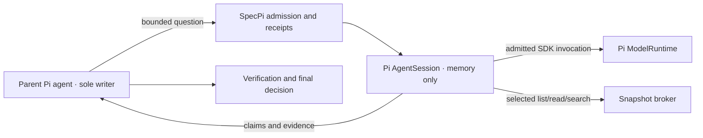

# Bounded delegation

Status: experimental implementation in the unreleased source. Disabled by default.
The package remains `specpi`; no separate npm package or background service is required.

SpecPi keeps one agent responsible for changes and acceptance. This extension adds
bounded, read-only workers for independent questions. It does not add a second writer,
an automatic planner, or a permanent team. The [research](research.md) supports testing
selective delegation; it does not establish that this implementation improves outcomes.

## Use normal Pi startup

```sh
pi
```

The native extension is discovered through the ordinary Pi package and SpecPi
install/update lifecycle. Existing Pi startup, UI, resources, trust decisions and
proxy configuration remain Pi-owned. Delegation needs no alternate launcher, extra
SDK host, separate runtime process or new setup path.

This experimental SDK integration explicitly supports **Pi 0.84.4 and 0.85.0**.
Other Pi versions cannot activate delegation; adding support requires fresh compatibility
review. The [compatibility record](research.md#pi-compatibility-evidence) distinguishes
the allowed versions from completed SDK/native validation. Normal SpecPi installation
keeps its separately documented host floor and 0.84.4 bootstrap pin.
Restart Pi to load a changed delegation
runtime version or change its working root. The broker uses the canonical working
directory captured for this Pi process.

Workers are actual SDK `createAgentSession` instances with in-memory session storage.
Pi runs their model/tool loop. SpecPi supplies admission, selected-source tools and
result checks; it does not implement a second conversation loop. Children load no
ambient extensions, skills, AGENTS files or parent session history.



The child uses a fresh Pi `ModelRuntime` with standard authentication, environment
and `models.json` resolution. Its settings take transport and thinking budgets from
Pi's configured global settings; project settings are not loaded. The parent model and
thinking level are explicit. Pi's public thinking-level clamp determines the effective
child level, which the adapter verifies. Pi handles authentication
and OAuth; SpecPi does not copy credentials or inspect private runtime fields.
Preflight rejects runtime-only authentication, selected extension-registered provider
overrides, model-specific headers, startup proxy configuration and mismatched safe
model descriptors because the fresh runtime cannot faithfully reproduce those parent
routes. Parent configuration is left unchanged; an unsupported route disables delegation.

This is **not full parent inference parity**. Parent request hooks, ephemeral runtime
settings and session affinity are not automatically transferred. A workflow requiring
those inherited controls for every request must keep delegation disabled. Receipts
bind supported model and source descriptors; they cannot certify an unchanged remote
service or every configuration change behind a stable provider identity.

## Enable deliberately

In the interactive session:

```text
/delegate on
/delegate status
/delegate limits
/delegate cancel <batchId>
/delegate off
```

`on` grants the displayed experimental calls/time envelope. There is no model-call
permission toggle in the model-facing tool. `limits` is read-only; the shipped ceilings
cannot be raised by prompts. Turning delegation off, changing guard policy, switching
sessions or models, navigating branches, and changing task/scope bindings revoke the
current generation. Off/on, `/reload` and session switches do not reset the Pi process's
counters or free requests that are still settling. The same in-memory controller remains
in use; restart Pi to load changed runtime code. Normal conversation leaf advancement
does not invalidate workers.

While delegation is off, its tool is removed from the parent's active tool list.
The command remains available, but the delegation tool schema is included in model
requests only after activation. Other active tools are preserved.

Command Guard continues to intercept the parent `delegate` tool. Strict mode presents
the effective capability envelope and binds approval to its policy fingerprint and
the exact call. Guard Off and Locked modes cannot activate delegation. A worker result
cannot authorize a write, a commit, a deployment, or an improvement.

## Admit a specific purpose

| Mode     | Required structure                                                                                                                    | Context and tools                                                                         |
| -------- | ------------------------------------------------------------------------------------------------------------------------------------- | ----------------------------------------------------------------------------------------- |
| `review` | A frozen artifact, original requirements, relevant constraints and actual validation facts. The parent checks findings before acting. | Nonempty inline context or selected files; selected-source tools when files are supplied. |
| `scout`  | A bounded evidence question with an independently checkable answer and a reason to separate the analysis.                             | At least one selected file; list/read/literal-search only, with no live web access.       |

The packet declares one benefit: `independent_review` for review jobs, or
`parallel_analysis` / `context_isolation` for scout jobs. It includes a nonempty `why`.
`parallel_analysis` also requires useful `parentWork`; this may be empty for the other
benefits. A final review can be useful even when the parent waits. The controller checks
this structure, not whether the claimed benefit will materialize. Duplicate questions
after trimming and case normalization are rejected; distinct text is not proof of
independent work.

Each job names its assigned global requirement IDs and receives only those requirements,
plus the fixed decisions and non-goals. Transfer original constraints and evidence,
not the parent's reasoning or verdict. Do not delegate routine lookups, small understood
edits, coupled mutable work, generic second opinions or repeated role-based answers.
Use parallel parent tool calls when retrieval alone answers the question.

Workers have no shell, writes, arbitrary plugin tools or recursive delegation.
The parent obtains and selects source material. Model routing, automatic retries,
live-web access, monetary admission and automatic policy tuning remain unimplemented.

`/task` remains optional. Changes to an active task contract invalidate delegation,
but the parent is still responsible for faithfully transferring the task into the packet.

Use `delegate run`, continue useful parent work, then `collect`. Collection can wait
up to 30 seconds without another model request. Do not poll on a fixed schedule.
Check the referenced evidence and `resolve` each report, including per-finding
dispositions. One changed-input `follow_up` is available under the original deadline
and counters. [Protocol and executable examples](protocol.md) define the exact fields.

## Enforced resource envelope

| Resource                  | Ceiling                                                                      |
| ------------------------- | ---------------------------------------------------------------------------- |
| Active worker requests    | 2 per Pi process, including cancelled requests still settling                |
| Batches / jobs            | 4 batches per Pi process; one unresolved batch; 2 jobs per batch             |
| SDK model invocations     | 32 per Pi process, 8 per batch; 4 per logical job including follow-up        |
| Follow-ups / retries      | 1 changed-input follow-up per job; provider and session retries disabled     |
| Time                      | 120 seconds per logical job; 300 seconds per batch, including follow-up time |
| Packet / child context    | 256 KiB, checked before dispatch                                             |
| Selected sources          | 200 files and 8 MiB per batch                                                |
| Tools                     | 12 calls and 64 KiB total returned JSON per logical job                      |
| Tool response             | Bounded reads/search; 16 KiB per snapshot read/search response               |
| Final report              | 16 KiB; 8 findings; coverage for each assigned requirement                   |
| Requested provider output | 8,192 tokens, clamped to the model maximum                                   |
| SDK-visible response      | 256 KiB acceptance limit on observed response content                        |

These are conservative experiment limits, not empirically optimal values. Each SDK
invocation is admitted before dispatch. Automatic provider/session retries and
compaction are disabled, so they cannot silently create another SDK request.
Pi authentication preflight occurs before the model-invocation counter; these quotas
do not count or bound Pi's authentication/OAuth preparation.

The native SDK stream is observed while the child runs. Its response checks are not
hard bounds on raw transport, hidden provider attempts, billing or process memory.
Bytes may already be buffered before an SDK event becomes visible. Cost is unavailable;
missing usage is never represented as zero. This version cannot satisfy a policy
requiring those unsupported guarantees.

Cancellation revokes broker access and requests SDK abort. Slots remain held through
SDK-visible stream/result and prompt settlement; that does not prove physical remote
execution has ended. Late content is discarded. A non-cooperative SDK/provider can
require ending Pi; a timeout does not launch a replacement behind its back. Completed
reports keep their original source bindings after the deadline, but child sessions are
released at the deadline and later follow-up is rejected.

## Evidence and retention

Snapshots contain only exact selected regular text files under the fixed canonical
working root of the Pi process. The broker rejects traversal, symlinks/junctions,
hardlinks, binary content, private path
names, unknown source IDs, and oversized reads. Each worker can search only its own
selection. The broker rechecks identity and content when capturing, accessing and
consuming evidence. Changed source bindings require a fresh batch.

This is a trusted-local-filesystem contract, not an operating-system sandbox or an
atomic filesystem snapshot. Filename restrictions cannot detect secrets embedded in
an ordinary source file. The parent must select appropriate material for the configured
model provider. Trusted Pi extensions remain privileged in the shared process despite
being absent from the child's resource loader. Only the submitted packet is inherited
automatically, not the parent transcript.

Each report separates worker claims from a host receipt: job/attempt identity, packet
digest, generation, result revision, route, state, counters and usage completeness.
Source references are validated for identity and line range; their truth is still a
verification question for the parent. `accept` records a parent assessment, not human
approval or verified task completion.

Child conversations use in-memory sessions and are released when their job is disposed
or reaches its deadline, after active SDK work settles. Snapshots, reports and the bounded
idempotency journal can remain in memory for the Pi process lifetime, including `/reload`
and session switches.
There is no child session database, raw metrics log,
credential copy, automatic resume, or secure memory-erasure claim. Normal Pi parent
tool results may be retained in its ordinary session. Turning delegation off does not
remove results already retained by Pi; review the session before sharing it.

## Implementation and evaluation

The modules under `extensions/delegation/` integrate Pi AgentSession with admission,
snapshot tools and closed result validation. There are no additional runtime dependencies
or separate host process. Compatibility requires verification against the supported
Pi SDK and ordinary package discovery, not merely a passing mock provider.

The evaluation plan separates deterministic runtime/security fixtures from comparative
task outcomes. Use isolated state and synthetic providers for contract tests; live
inference needs separate authorization. Such fixtures do not establish parity with
the parent's full inference pipeline or every production provider.

The [evaluation plan](evaluation.md) compares selective delegation with strong single
agents, serial workflows and always-delegate baselines using matched resource budgets.
No production quality, speed or cost improvement is claimed until those experiments run.
The [original design](design.md) and [target protocol](design-protocol.md) preserve the
broader proposal and its currently unimplemented proof obligations. The implemented
[calls/time protocol](protocol.md) is the source of truth for this release's behavior.
