# Delegation protocol: archived version 1 target proposal

This is the original target design contract, not the implemented API. The normative
words **must** and **must not** specify requirements for that stronger future contract.
Use the [implemented calls/time protocol](protocol.md) and [guide](README.md) for the
current experimental interface. It does not supply this proposal's hard raw-transport,
per-provider-attempt or monetary admission guarantees, live web adapter, or alternative
model routes. The schemas and command examples below must not be submitted as if they
were the implemented protocol.

See the [archived architecture](design.md) for target policy and
[evaluation](evaluation.md) for the distinction between current fixtures and unmet
proof obligations.

## 1. Authority and ownership

Separate three objects:

1. **Request:** a parent-model proposal. All fields are untrusted and can only request
   capabilities already granted by the human.
2. **Envelope:** a host-created record binding a validated request to identities,
   permissions, sources and resource reservations. A model cannot replace its fields.
3. **Result:** a worker's claims plus separately generated host observations. Worker
   prose cannot manufacture host observations or acceptance.

Use closed schemas, explicit version numbers, bounded strings and arrays, and rejection
of unknown fields. Validate input before dispatch and output before collection. This
is an in-process protocol with structured objects; no HTTP listener, RPC server, or
message serialization framework is required.

## 2. Parent request

One tool named `delegate` accepts this discriminated union:

| Operation   | Required input                                                               | Outcome                                                                                   |
| ----------- | ---------------------------------------------------------------------------- | ----------------------------------------------------------------------------------------- |
| `run`       | Objective, job proposals, selected input references, requested limits        | Admit one batch; return IDs and effective limits, or a deterministic rejection            |
| `status`    | Batch ID                                                                     | Compact states, coverage counts, usage and accounting availability                        |
| `collect`   | Batch ID, optional job IDs, acknowledged revision cursor and bounded wait    | Return applicable payloads after the caller's acknowledged cursor; no destructive dequeue |
| `follow_up` | Existing job/result binding, correction or new evidence, idempotency key     | Admit one additional attempt under the original job limits and deadline                   |
| `resolve`   | Exact result binding, disposition and per-finding decisions, idempotency key | Record parent adjudication; never authorize a new action                                  |
| `cancel`    | Batch or job ID                                                              | Revoke admission and request cancellation; report requests still settling                 |

For stage 1, the single review call may finish within `run`; it uses the same envelope
and result schema. Stage 2 adds asynchronous return without changing the result contract.
`collect` can wait at most 30 seconds; it does not create polling timers or new model
turns. Collect immediately before consuming the relevant evidence, not on a fixed loop.

`collect` returns a revision cursor without advancing the caller's acknowledgment.
Only the next request's explicit cursor acknowledges receipt. Repeating the old cursor
returns the same applicable payload, so a response lost before consumption can be
recovered. Results remain available within bounded session retention until resolved,
discarded or explicitly expired; advertise any expiration rather than silently
returning an empty successful result.

`follow_up` requires `batchId`, `jobId`, `attemptId`, `packetDigest`, `resultRevision`,
`taskGeneration`, and an idempotency key. It is admitted only from `incomplete` with an
explicit context gap, or `invalid` with a correctable format error. The controller
validates that the correction addresses that outcome, that prior provider resources
have settled, and that the original task/policy bindings, deadline and counters permit
another attempt. Authority and new source grants are rechecked. An atomic transition
records the new immutable attempt and debits the **existing** job, batch and session
ledgers. It does not create another batch or refresh the deadline. The same idempotency
key and payload return the existing outcome; reuse with a different payload is rejected.

Transient transport retries are controller-owned attempts under the same job, not a
parent `follow_up`. Cancelled, expired, stale, accepted and discarded jobs cannot be
revived through this operation. A materially new task requires a new admission and
still consumes the existing session allowance. A renamed request does not authorize
automatic recovery of a cancelled job.

`resolve` binds to those same exact result identity fields and includes a disposition
(`accept`, `discard`, or `needs_check`) plus decisions for every presented finding
(`confirmed`, `rejected`, or `needs_check`, with reasons and evidence IDs). The host
rejects stale revisions and mismatched task generations. An accepted result must have
required coverage and no unresolved material finding. Accepting a review report means
its evidence has been adjudicated; it does not assert that the code is ready or that
confirmed defects have been fixed. Incomplete, invalid and failed results can be
discarded or held for investigation but cannot be accepted as complete. Apply each
idempotent resolution atomically. Host state does not infer acceptance from prose,
collection, silence, or a worker verdict. Finding decisions remain separate from the
overall disposition. Ordinary task completion still follows SpecPi's existing gates.

Proposed request example:

```json
{
    "version": 1,
    "op": "run",
    "objective": "Resolve two independent causes of the observed regression",
    "jobs": [
        {
            "key": "cache-invalidation",
            "mode": "investigate",
            "question": "Can the cache retain a value after its source changes?",
            "requirements": ["R1"],
            "sourceIds": ["src-cache", "src-cache-callers", "src-cache-tests"],
            "acceptance": "Identify the relevant path and evidence, or state what prevents a conclusion.",
            "decisions": ["Public cache API behavior must remain compatible."],
            "nonGoals": ["Implementing a fix", "Changing public API behavior"],
            "independence": "The parent is separately investigating event ordering.",
            "parentAlternative": "Read these same sources sequentially in the parent.",
            "reason": "A substantial independent source investigation can run while event ordering is inspected."
        }
    ],
    "limits": {
        "maxRequests": 4,
        "deadlineMs": 120000
    }
}
```

Source IDs must already refer to a host-validated manifest prepared under the session
grant. The model does not create that manifest by inventing IDs. A repository capture
interface validates requested paths before issuing IDs. User-provided attachments or
parent-selected excerpts get explicit provenance distinct from broker observations.

The example's acceptance criteria permit an honest unknown. An instruction to prove a
preferred conclusion is not an acceptable evidence task.

## 3. Host envelope

| Field                                             | Meaning                                                                                   |
| ------------------------------------------------- | ----------------------------------------------------------------------------------------- |
| `version`                                         | Protocol version; reject unsupported versions                                             |
| `batchId`, `jobId`, `attemptId`                   | Host-generated opaque identities                                                          |
| `policyGeneration`                                | Immutable human policy and capability selection                                           |
| `taskGeneration`                                  | Active task identity, requirement revision, scope grant and session epoch                 |
| `taskBinding`                                     | Exact card digest and requirement IDs, or an explicit ephemeral requirement set           |
| `packetDigest`                                    | SHA-256 of canonical packet content and selected source manifest                          |
| `modelRoute`                                      | Bound model and effective configuration identity; no secrets or raw authorization headers |
| `capabilities`                                    | Closed broker operations and source/network grants                                        |
| `limits`                                          | Effective job and batch reservations, deadlines and output limits                         |
| `question`, `acceptance`, `decisions`, `nonGoals` | Validated task content                                                                    |
| `sources`                                         | Opaque IDs, hashes, media type, coverage, captured location and provenance                |
| `priorAttempt`                                    | Optional parent-approved correction or additional evidence from the same logical job      |

Canonical serialization must define UTF-8 encoding, key ordering, numeric handling and
array order. Hash the exact bytes supplied to a worker, including explicit omitted or
unavailable inputs. A digest detects accidental drift; it is not a signature or proof
against a compromised host extension. Do not expose reversible configuration secrets
through fingerprints; use a host-owned opaque generation for sensitive configuration.

Fresh context contains the task contract, mode instructions, admitted tools and source
references. Tool outputs are appended as data. A webpage or source comment cannot
alter the envelope by resembling its JSON syntax.

## 4. Evidence references

Every accepted reference resolves through a host-managed evidence table:

| Kind               | Required binding                                                                               | Limit of the evidence                                                |
| ------------------ | ---------------------------------------------------------------------------------------------- | -------------------------------------------------------------------- |
| Snapshot source    | Source ID, exact hash, one-based line or byte range                                            | Supports claims about captured bytes only                            |
| Public source      | Fetch receipt, final URL, retrieval time, source date when available, extracted range and hash | Retrieval does not establish factual correctness                     |
| Parent observation | Receipt ID, origin, observed result, bound source generation when relevant                     | A parent-authored description is not an independently executed check |
| Host check receipt | Fixed validator identity, actual outcome, environment/source binding                           | Valid only for the recorded check and inputs                         |

The worker can cite a receipt ID it received; it cannot register an observation as if
the host executed it. The host rejects nonexistent IDs, impossible ranges, wrong
hashes and references outside the grant. Mark exact quotations separately from
paraphrase or inference. Preserve relevant source-version distinctions.

Source text may include malicious instructions. The broker supplies it as bounded tool
data. The model-facing worker has no tool for shell execution, filesystem mutation,
credential lookup, delegation, persistent memory, or capability expansion. This is a
closed tool interface under a trusted process, not a claim of perfect prompt-injection
resistance or OS containment.

## 5. Worker result and host receipt

The worker returns:

```text
status: complete | partial | needs_context
answer: bounded answer to the assigned question
coverage[]:
    requirementId, covered | uncovered | not_applicable, explanation, evidenceIds[]
findings[]:
    findingId, claim, trigger, consequence,
    observed | inferred | unverified,
    evidenceIds[], contraryEvidenceIds[], limitations
missing[]:
    neededEvidence, affectedConclusion, reason
suggestedNextStep: optional bounded text, never an executable action
```

For review, add severity based on impact and the affected source location. No confidence
percentage or aggregate self-score is required. For research, distinguish publication
status and source date, and include evidence against the proposed conclusion. For
investigation, report failed hypotheses that affect the answer. For consultation,
prefer a discriminating next experiment to unsupported certainty.

The host separately attaches:

```text
hostStatus: ready | incomplete | invalid | failed | cancelled | expired | stale
identity: batchId, jobId, attemptId, packetDigest, taskGeneration, resultRevision
observations: sourceReceipts[], toolOutcomes[], stopReason
usage: perRequestRecords[], totals, availabilityByCategory
responseLimits: rawBytesReceived, parsedBytesRetained, overflow, bufferingBoundVerified
timing: queuedAt, startedAt, settledAt, elapsedMs
limits: admitted, consumed, reserved, stillSettling
validation: schema, references, coverage, generation, truncation
```

The collection response separately supplies `collectionCursor`, a batch event position
used to acknowledge delivery. It is not the job's `resultRevision`: follow-up and
resolution bind the exact result revision even if a batch cursor advances because a
different job produces an event.

Persist original assistant/tool message structures in the worker's bounded in-memory
loop as required by the provider, including opaque signatures. Do not fabricate,
rewrite or transplant provider reasoning blocks. The parent sees the bounded result,
not hidden chain-of-thought or the entire worker transcript.

For usage, separate input, output, cache reads/writes, tool charges and cost. Preserve
provider category semantics: Pi's output accounting can already include reasoning,
so adding reasoning a second time would inflate totals. Distinguish known zero from
missing data and estimated cost from reported cost. A returned error can still have
billable usage. Include unsuccessful and cancelled attempts.

## 6. Lifecycle

```mermaid
stateDiagram-v2
    [*] --> proposed
    proposed --> rejected: admission fails
    proposed --> queued: envelope and reservation created
    queued --> running: capacity available; preconditions rechecked
    queued --> cancelled: grant revoked or user cancels
    running --> ready: complete payload and host validation
    running --> incomplete: partial answer or missing context
    running --> invalid: schema, evidence or truncation error
    running --> failed: provider or broker failure
    running --> cancelled: cancellation
    running --> expired: deadline
    ready --> stale: task or required source binding changes
    ready --> accepted: parent adjudicates
    ready --> discarded: parent rejects result
    incomplete --> discarded
    invalid --> discarded
    failed --> discarded
```



The diagram shows logical result state. Resource settlement is tracked separately:
`reserved`, `in_flight`, `settled`, or `uncertain`. `cancelled` does not assert that the
provider stopped billing. A cancelled or expired request cannot publish a late result.
An adapter that ignores cancellation retains its slot as still settling; do not start
new work under the fiction that no request is running.

Review output is accepted against its frozen target. On any relevant source change,
revalidate or mark it stale before use as completion evidence. Research citations may
remain informative after an unrelated code edit, but requirement/policy drift always
requires explicit parent reassessment. Scope determines relevance; a changed unrelated
file must not invalidate every independent research result.

Ordinary advancement of a session leaf is not branch navigation. Use a controller
epoch changed on actual task/policy navigation, not a rule that invalidates jobs after
each normal parent tool result. Pi 0.84.4 exposes `session_before_switch`,
`session_before_fork`, `session_before_tree`, `session_tree`, `session_start`, and
`session_shutdown`; there is no assumed `session_switch` or `session_fork` after-event.
Before-events may conservatively cancel work even if navigation is later declined.
Restarting after that is explicit, never a hidden retry.
[Pinned lifecycle contracts](https://github.com/earendil-works/pi/blob/v0.84.4/packages/coding-agent/src/core/extensions/types.ts#L522).

## 7. Retries, follow-ups, cancellation and deduplication

Retry only a classified failure, with its reservation intact. Honor provider backoff
inside the original deadline. A transport retry after uncertain dispatch can duplicate
billing; label it accordingly. Do not promise exactly-once provider execution.

A `needs_context` follow-up creates a new immutable attempt under the same job ID. It
includes what changed and why that addresses the gap. The old result remains marked
incomplete. Call, tool, byte and deadline counters remain attached to the logical job
and batch; a follow-up cannot reset them. Limit it to one generation initially.

Deduplicate only exact active equivalents: same task and policy generation, mode,
question/acceptance contract, source hashes, model route and relevant settings. Return
the existing job identity for a repeated request. Do not infer that semantically similar
questions are equivalent. Cross-session result reuse is out of scope.

Cancellation must revoke broker access before awaiting provider settlement. Combine
the parent signal with job and batch deadlines. Recheck revocation and counters before
every complete tool invocation and model request. Partial streamed tool arguments are
never executable. Check terminal `stopReason` as well as rejected promises: Pi streams
can resolve an assistant message with `error` or `aborted` status. The scheduler's own
abort state remains authoritative when setup errors obscure cancellation.

## 8. Scheduling and provider interface

The following pseudocode expresses ordering, not an available Pi API:

```text
admit(request):
    validate closed request and current human policy
    bind immutable task, source and model generation
    check exact deduplication key
    reserve batch capacity atomically
    enqueue only ready independent jobs

run(job):
    acquire concurrency slot
    recheck authority, generation, deadline and source binding
    build explicit child context and broker schemas
    while another request is allowed:
        reserve next request before dispatch
        response = InferencePort.request(context, admittedOptions, signal,
            admissionBeforeEveryUnderlyingAttempt, rawByteLimit)
        account for response, terminal status and uncertainty
        reject incomplete tool calls or oversized messages
        if final result: validate and stop
        for each complete tool call in this response:
            recheck grant, counters and cancellation
            execute through EvidencePort; append bounded tool result
    settle or quarantine outstanding resources
    publish only if the job generation remains valid
```

`InferencePort` and `EvidencePort` are proposed injected interfaces. The former must
be host-owned and preserve request-policy behavior; the latter is the closed broker.
The Pi 0.84.4 public registry completion facade is insufficient to claim full host
pipeline parity. [Target architecture compatibility gate](design.md#8-pi-runtime-and-package-boundary).

Each underlying inference attempt, including an internal SDK retry, must obtain a
controller reservation immediately before dispatch. Disable opaque retries when the
adapter cannot call this admission hook. Initial dispatch and each admitted retry get
separate attempt receipts; admission must not debit the initial attempt twice. The
same retry classifier, job retry count, deadlines, provider backoff and batch/session
ledgers apply. If the adapter cannot enforce this boundary, it cannot claim hard
attempt limits and must be rejected for the default policy. Silent provider fallback
to another model is also forbidden.

The port's raw-byte ceiling covers the entire decoded application response, including
stream framing, tool arguments, thinking, text and metadata, across bounded chunks.
Also bound decompression and transport buffering before handing bytes to a parser;
reject adapters with opaque unbounded buffering. Stop accumulating and signal abort
as soon as the next chunk would exceed the allowance. Do not parse or append the
oversized content, and do not truncate it into an apparently valid final object.
Record overflow and keep uncertain billing and non-cooperative requests in settlement
tracking. The byte bound is not a guarantee about provider-side generation or billing.

For asynchronous work, the host issues a job-lifetime lease containing immutable
admitted route data and cancellation hooks. Do not retain a stale invocation-scoped
extension context after `run` returns. The lease is revoked by actual task/policy
invalidation, user cancellation, shutdown or deadline; a normal parent tool return
must not accidentally expire it. Its lifetime and hook behavior are part of the
proposed host bridge, to be proven by integration fixtures.

Serialize tool calls within one worker initially. Parallelism is across admitted jobs.
If `pi-agent-core` is used to preserve message protocol correctness, explicitly configure
its tool execution policy; its default is parallel. Limits require pre-call enforcement,
not only `shouldStopAfterTurn`, which is evaluated after work already occurred.

No automatic sibling steering is necessary. If a finding invalidates another job's
premise, the parent cancels that job and submits an explicitly revised contract, charging
all abandoned work to the same evaluated task.

All batches also debit the session allowance. Starting another batch, changing an
ephemeral requirement set, or toggling the tool cannot reset consumed usage. A human
policy change must explicitly renew an exhausted allowance; it cannot erase the
reported cost of prior work.

## 9. Protocol acceptance tests

Before a real provider is enabled, fixtures must demonstrate rejection of forged host
fields, unsupported versions, oversized or truncated output, nonexistent source IDs,
stale revisions, duplicate results, recursive delegation, denied tools and exhausted
reservations. Race tests must cover simultaneous admission, cancellation between a tool
decision and execution, and late results after task navigation.

A valid schema is only the beginning. An answer with valid references can still be
wrong. Parent adjudication and actual task checks are required for acceptance; a
protocol receipt must never be displayed as proof that the task itself is correct.
