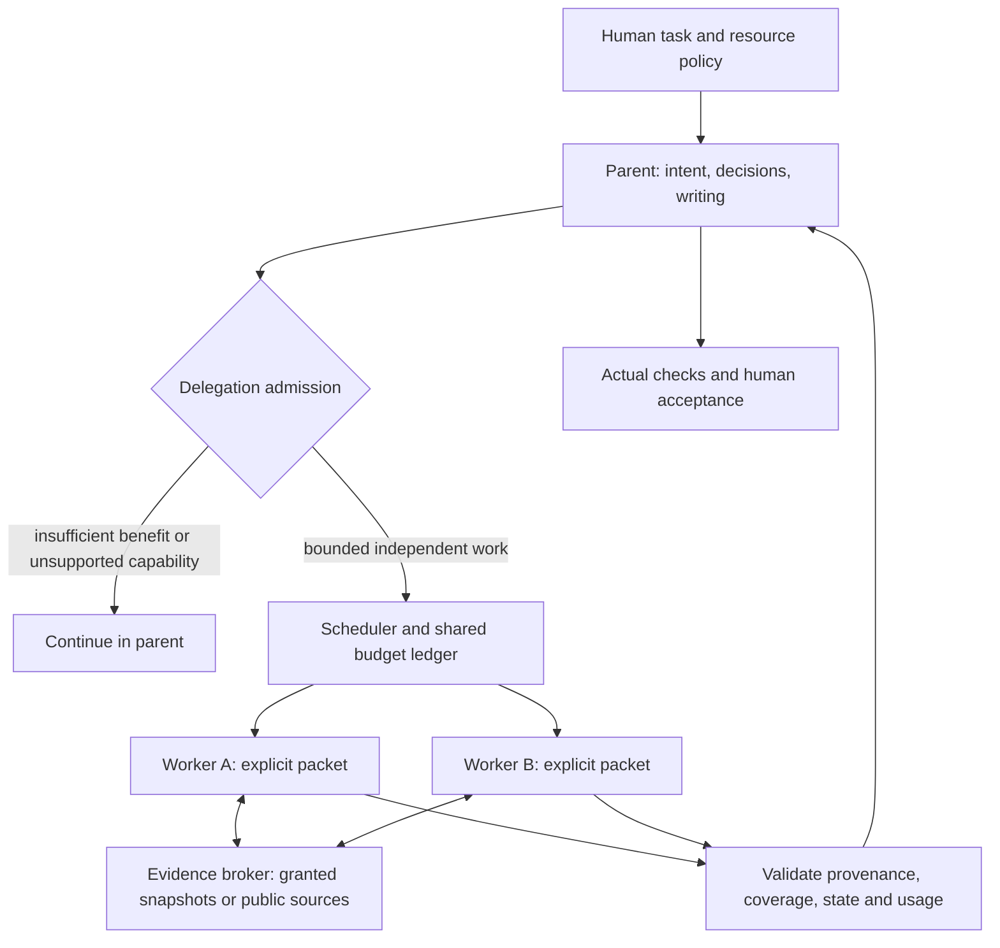

# SpecPi delegation design: archived target proposal

Status: archived target architecture, not the implemented runtime contract.

The experimental implementation is part of `specpi` and is disabled by default.
Read the [implemented guide](README.md) and [calls/time protocol](protocol.md) for
supported commands, exact SDK compatibility, limits and trust assumptions. This
document preserves the original broader proposal, including unimplemented live-web,
alternative-model, monetary, raw-transport and underlying-attempt guarantees. Its
normative requirements, command sketches and delivery stages are targets, not runtime
promises or evidence that the experiment has passed outcome evaluation.

Research reviewed through 5 September 2026. The original working name
`specpi-delegation` below was a design placeholder, not a separate published or reserved
npm package.

The [target protocol](design-protocol.md) specifies this proposal's messages and state
transitions. [Research](research.md) records the evidence and its limits.
[Evaluation](evaluation.md) separates current fixture coverage from experiments and
stronger proof obligations that remain outstanding.

## Decision

Build an optional Pi extension that gives one capable parent **bounded access to
additional reasoning and investigation**, while the parent owns changes and acceptance.
Use one scheduler, one provider adapter, one evidence broker, and one result format.
Start with a tool-free review call, then add independent investigation and research
through the same protocol. Treat consultation as another bounded call, rather than
introducing a second planner or a permanent team.

The objective is the best accepted outcome within the user's resource constraints.
There is no demonstrated universal optimum in agent count, topology, model, or context
size. The architecture therefore includes **no delegation** as a first-class result of
routing. It should make a useful two-worker investigation straightforward and make an
unnecessary ten-worker swarm difficult to create.

The evidence supports this structure more strongly than an unrestricted writing swarm.
Task-dependent gains in the [existing seven-study assessment](../../site/single-agent/index.html)
establish specific opportunities. Cognition's April 2026 production account also
describes useful review and consultation around a single writer, while reporting a
quality ceiling when the primary model was too weak to delegate effectively.
[Cognition, 22 April 2026](https://cognition.com/blog/multi-agents-working).

This design is an engineering inference. Its defaults and promotion thresholds below
are proposed operating parameters, not numbers established by those studies.

## 1. Choose execution by task shape

| Situation                                                           | Starting route                                             | Why another context may help                                             | Stop condition                                                       |
| ------------------------------------------------------------------- | ---------------------------------------------------------- | ------------------------------------------------------------------------ | -------------------------------------------------------------------- |
| Small fix, known answer, one short lookup                           | Parent only; batch independent tools when useful           | Usually insufficient benefit                                             | Do not create a worker                                               |
| Long sequential reasoning with all relevant context already present | Same agent, stronger workflow or supported model selection | Separate contexts can lose the reasoning chain                           | Keep execution serial                                                |
| Two substantial, independent evidence questions                     | Two investigation or research jobs                         | Parallel exploration and less irrelevant material in the parent          | Evidence sufficient to answer the questions                          |
| One large source collection                                         | Partition by question or source ownership, then synthesize | Workers can search deeply without sending every intermediate result back | Coverage achieved, result and resource limits reached                |
| Frozen implementation with meaningful review risk                   | One fresh reviewer                                         | Different context and focused inspection                                 | Findings and coverage returned; parent adjudicates                   |
| A specific difficult decision or failed approach                    | One capable consultant                                     | A different capability or fresh interpretation may help                  | Answer, discriminating next experiment, or explicit missing evidence |
| Coupled implementation, evolving interfaces, shared generated files | Parent is the only writer                                  | Concurrent writers introduce integration decisions                       | Finish the interface or obtain evidence before proceeding            |

These are routing hypotheses. The parent can misclassify a dependency or a source
collection. The scheduler checks the declared contract; it cannot prove semantic
independence. Evaluation must count bad decomposition as a system failure.

Four modes share one engine:

- **Review:** inspect a frozen packet; report material defects and uncovered requirements.
- **Investigate:** answer a repository question using bounded snapshot reads.
- **Research:** answer an external evidence question using an explicitly enabled web adapter.
- **Consult:** examine a difficult decision using selected context and, when authorized,
  a different exact model. This mode has no tools initially.

A model switch inside the parent's existing execution is a separate alternative in the
evaluation. Learned sequential routing has evidence of its own; it does not establish
the benefit of spawning children. [MTRouter](https://aclanthology.org/2026.acl-long.2045/).

## 2. One level of delegation, one owner of decisions



Workers cannot spawn workers, send sibling messages, alter policy, or write the project.
They return evidence to the parent. The parent decides whether a discovery changes the
task or another lane. A changed decision produces a new packet generation; it does not
silently replace instructions in a running job.

Initially the scheduler accepts a batch of independent jobs. Dependent work requires
the parent to accept the prerequisite and submit the next batch. This gives a useful
parallel frontier without a general workflow engine, distributed message bus, agent
registry, or arbitrary task graph interpreter.

Parallel work is admitted only when its result is needed and either the parent has
useful independent work or multiple workers can finish independent questions together.
A review may be entirely serial and still earn its cost through improved detection.
There is no requirement to keep workers busy.

## 3. Human control without approval fatigue

Installation and activation are separate. The package starts disabled and adds no
standing model calls. Proposed command surface:

```text
/delegate                 Show mode, grants, limits, running jobs and usage
/delegate on              Enable bounded delegation for this session
/delegate off             Stop admission and cancel outstanding jobs
/delegate limits          Inspect or change the session's resource envelope
/delegate cancel <id>     Cancel one job or batch
```

Activation presents the concrete capability envelope: exact model route, review-only
or snapshot access, web access if any, concurrency, call limits, retention, and budget
accounting limitations. A human-approved envelope permits subsequent parent requests
within that envelope. It does not require another permission prompt for every worker
or file read. Human instructions already authorizing an exact envelope can satisfy this
selection. Unsupported capabilities remain unavailable.

The parent proposes a job through one model tool, `delegate`, with operations `run`,
`status`, `collect`, `follow_up`, `resolve`, and `cancel`. A `run` response returns an opaque batch ID and the
admitted job identities. Detailed worker tools and prompts are disclosed only when the
corresponding mode is used. Keep the standing description small; do not load four role
manuals into every turn.

The extension owns resolved grants, budget reservations, model identities, job IDs, and
generation tokens. The parent model cannot grant itself broader access by changing
tool arguments. A denied Command Guard operation remains denied; delegation is never
an alternate execution route for it. In Strict mode, approval of the top-level custom
tool must expose the effective delegation capabilities, rather than an opaque label.

User-facing progress is one status row, for example:

```text
Delegation  1 running · 1 ready · 4/12 model calls · cost unavailable
```

Only blockers, usable results, and meaningful state changes deserve notifications.
No periodic narration, hidden follow-up turns, or automatic restart after closing Pi.

## 4. Admission and resource allocation

Admission has two layers. **The parent judges usefulness; deterministic code enforces
authority and limits.** Do not ask another model to decide whether to launch a model.

The parent supplies a short reason, deliverable, evidence needed for acceptance,
independence boundary, expected remaining work, and the best parent-only alternative.
The controller then checks:

1. The mode, model, tools, and inputs are inside the current human-authorized policy.
2. Original requirements and relevant settled decisions are represented in the packet.
3. The job is ready; its prerequisites are accepted and its result has a named consumer.
4. Its source snapshot and task generation are still current for admission.
5. No equivalent job is running or already has an applicable result in this batch.
6. A concurrency slot and the job's full resource reservation are available.
7. The result has a feasible verification path. A worker's confidence is not that path.

Failure returns a reason and leaves the parent able to work. It does not launch a
smaller unrequested model, widen access, or silently weaken an exact provider rule.

Once measured task-class data exists, select routes against one declared objective:

| Objective | Route comparison                                                               |
| --------- | ------------------------------------------------------------------------------ |
| Cost      | Minimize expected total cost per accepted task, with a specified quality floor |
| Time      | Minimize expected elapsed time, with quality and spend constraints             |
| Quality   | Maximize accepted outcomes under a fixed resource envelope                     |

Total cost includes packet preparation, all model and tool work, retries, parent
synthesis, verification, and correction. Report human review time separately unless a
human explicitly chooses a monetary conversion. Compute cost per accepted outcome as
total cohort cost divided by accepted tasks, including the cost of failed tasks.
When none is accepted the measure is undefined, not zero.

Do not invent a numerical expected-value estimate from an LLM's self-reported
confidence. Until a route is evaluated, label it experimental and use explicit bounded
trials. Learned routing, automatic difficulty prediction, and online bandit exploration
are unnecessary for the first implementation.

## 5. Context is a contract, not a transcript fork

Every job receives the original relevant requirements, its exact question, acceptance
criteria, non-goals, selected decisions, and reference identities. It does not inherit
the parent's tools, mutable memory, complete conversation, or unrelated instructions.
No Pi history or authentication files are scanned to construct a packet.

Use different context policies deliberately:

| Mode        | Initial context                                                              | Deliberately excluded                          | Expansion                                                                     |
| ----------- | ---------------------------------------------------------------------------- | ---------------------------------------------- | ----------------------------------------------------------------------------- |
| Review      | Requirements, frozen diff, relevant source, actual check receipts            | Implementation reasoning and preferred verdict | Specific missing source requested; bounded snapshot access in a later release |
| Investigate | One question, hypotheses, repository map, source manifest                    | Unrelated task transcript                      | Broker reads within the granted snapshot                                      |
| Research    | Question, source boundaries, dates, exclusions, required output              | Parent's desired conclusion                    | Bounded search and retrieval of approved public sources                       |
| Consult     | Decision, constraints, failed attempts, observations, competing explanations | Unrelated history and hidden model reasoning   | A targeted request for additional evidence                                    |

Fresh review still receives the human requirements. Withholding those requirements to
make a reviewer more independent can create irrelevant findings. A defect reviewer may
question a requirement but cannot redefine it. A separate code-only review is a possible
evaluation ablation, not the normal acceptance contract.

Distinguish two optimization steps. **Selection** omits irrelevant material and preserves
explicit references to what remains available. **Compression** rewrites information and
can lose crucial details. Start with selection and deterministic limits. Use model
summaries only as indexed leads, retain their source references, and measure any solve
rate loss before adopting a compression policy.

Workers return `needs_context` when missing information prevents a grounded answer.
They name the required evidence and the conclusion it would resolve. One focused
follow-up can be admitted within the original batch budget. Repeated gaps return the
task to the parent; they do not create an unlimited conversation.

Keep a stable instruction prefix and append changing evidence after it, where the
provider supports useful cache behavior. Record actual cache accounting when exposed.
Never assume a cache hit, transfer provider-specific reasoning blocks between models,
or sacrifice necessary context to satisfy a speculative token-saving target.

## 6. The evidence broker

Workers get explicit function schemas, never a generic shell or arbitrary extension
dispatcher. The first repository tools are `list_sources`, `read_source`, and
`search_sources`, operating on opaque IDs in a bounded in-memory snapshot. A source ID
maps to captured bytes and a content hash, not a worker-supplied filesystem path.

The parent selects repository-relative inputs. The host resolves and validates them
before capture: canonical root containment, regular files, allowed types, explicit byte
limits, and exclusion of private state, credentials, binary files, links and reparse
points whose containment cannot be established. Search is a bounded literal search
initially; arbitrary regular expressions and shell-based grep are unnecessary. The
broker does not invoke project scripts, Git filters, LSP plugins, or package hooks.

Take source hashes before and after capture. This detects observed changes but is not
an atomic operating-system snapshot. Serve only the captured bytes. A manifest labels
the snapshot's coverage and capture limitations. If a required consistent source set
cannot be captured, return `source_changed` and ask the parent to establish a stable
target. Never claim to have reviewed a moving checkout as one atomic revision.

Large repositories do not justify uploading the repository. Start with a selected
bounded manifest. If the selected input exceeds its envelope, request a smaller scope
or an explicit expansion. Hidden omissions or silently shortened evidence are invalid.
This also keeps source hashes and exact line citations useful for parent inspection.

The research adapter is a separate opt-in capability with typed `search_public` and
`fetch_public` operations. It must implement a reviewed network boundary: allowed
schemes, host/IP checks at connection time and redirects, public-address restrictions,
byte/time limits, no cookies or inherited authorization, bounded downloads, and no
execution of page scripts. URL parsing alone does not prevent DNS rebinding or access
to private services. If the chosen transport cannot enforce the declared boundary,
public fetch is unavailable. Do not quietly proxy arbitrary existing browser or MCP
tools through the worker. Parent-supplied public excerpts remain a usable fallback.

Source text and worker output are untrusted evidence. Neither can create permissions,
change budgets, inject system instructions, or authorize a sibling action. Exact source
locations establish traceability; they do not establish truth.

## 7. Resource limits that describe what is actually enforced

These are initial trial defaults, to be tuned through evaluation:

| Limit                      | Proposed default                                                            | Enforcement                                                                        |
| -------------------------- | --------------------------------------------------------------------------- | ---------------------------------------------------------------------------------- |
| Active workers             | 2 per batch; one active batch per parent session                            | Scheduler semaphore                                                                |
| Session allowance          | 4 batches and 48 model requests                                             | Monotone session ledger; renewed only by a human policy change                     |
| Logical jobs               | 4 per batch                                                                 | Admission counter; no nested delegation                                            |
| Model requests             | 12 total per batch, including retries and follow-ups                        | Reserve before every underlying inference attempt                                  |
| Requests per logical job   | 2 for review/consult; 4 for investigate/research                            | Review/consult uses one initial call; the second is at most one retry or follow-up |
| Follow-up generation       | At most 1 per job                                                           | Explicit parent resubmission; same batch allowance                                 |
| Tool calls                 | 12 per job                                                                  | Broker counter before execution                                                    |
| Job / batch deadline       | 120 / 300 seconds                                                           | Monotonic deadline, cancellation, late-result rejection                            |
| Selected source snapshot   | 8 MiB and 200 files per batch                                               | Checked before reads; bounded allocation                                           |
| Serialized model context   | 256 KiB per request, also within model context limits                       | Byte cap plus provider token/context validation when supported                     |
| Evidence returned by tools | 64 KiB total per job                                                        | Count bytes; explicit incomplete result at limit                                   |
| Final worker payload       | 16 KiB; 8 findings                                                          | Reject oversized payloads, never silently accept a truncated object                |
| Raw provider response      | 256 KiB per attempt, including text, reasoning, tool arguments and metadata | Bound transport buffering and accumulation before parsing or appending content     |
| Provider output limit      | 2,048 tokens per request where supported                                    | Provider request setting; record unsupported accounting                            |
| Retry                      | One classified retry per job                                                | Counts against calls, deadline, and spend admission                                |

All attempts under the same logical job share its tool, evidence, elapsed-time, and
follow-up limits. A replacement does not reset the counters. Limits are configurable
inside human policy; worker tool arguments can only request less. Source and result
bytes are local memory limits, not token estimates. Hidden reasoning, provider retries,
tokenization, rate limits, and post-cancellation billing require separate accounting.
Batch completion, `/task` revision, normal user steering and model changes do not
replenish the session allowance. An on/off toggle does not erase consumed usage.
Session restart clears ephemeral state and starts disabled; no work resumes by itself.

For monetary admission, reserve the conservative cost of the next request, using
complete supported pricing and bounded billable input/output categories; do not assume
cache discounts. Atomically reserve before dispatch, reconcile with actual usage, and
keep unknown in-flight charges reserved. Every retry pays for its own reservation.
Reject concurrent requests whose combined reservations exceed the admitted envelope.

Here a counted model request means an underlying inference attempt, including an SDK
or provider-adapter retry. `InferencePort` must either disable opaque automatic retries
under the admitted child policy or obtain controller admission before every attempt.
One method call that internally retries three times consumes four attempts. Report
high-level invocations separately. An adapter that cannot expose or prevent hidden
attempts cannot satisfy a hard attempt cap and is unavailable for that policy.

The raw response cap applies while receiving every content category, before assembling
JSON, reasoning, tool arguments or a final result. The adapter must bound transport
chunks and its own buffering, not merely check the completed response size. Overflow
aborts the attempt, preserves usage uncertainty and produces an invalid/incomplete
outcome; a truncated object is never treated as a successful answer. Discard buffered
content when its job no longer needs it, while retaining bounded usage and state.

A configured spend ceiling is an **admission limit**, not a guarantee of a final invoice.
Cancellation cannot retract work already performed by a provider. If the provider cannot
supply a defensible cost bound, either decline a cost-capped route or use a separately
human-authorized calls/time-limited mode with cost explicitly marked unavailable. Never
turn missing billing or subscription usage into `$0.00`.

This extension can enforce its own requests and broker calls. It cannot cap the parent's
ordinary inference, other extensions, or a provider's unrelated account usage. Reserve
parent synthesis and verification capacity in the evaluation plan; an extension-only
spend counter must not be presented as the total task budget.

## 8. Pi runtime and package boundary

The following records the original compatibility analysis. The current experiment
uses the explicit `specpi agent` SDK host at Pi 0.84.4 exactly; its supported pipeline
and remaining transport limitations are documented in the [implemented guide](README.md).
The target `InferencePort` contract below is not an exported Pi API or a claim that
the experiment enforces every underlying provider attempt or raw response byte.

**Production is gated on a supported host request capability.** Inspection of Pi
`v0.84.4`, SpecPi's reviewed host floor, found an important distinction:

| Verified public contract                              | What it establishes                                             | What it does not establish                                                                             |
| ----------------------------------------------------- | --------------------------------------------------------------- | ------------------------------------------------------------------------------------------------------ |
| `ctx.modelRegistry.complete(model, context, options)` | Runtime-owned authentication and effective provider preparation | The host's full request hooks, thinking translation, settings, transport and session-affinity pipeline |
| `ctx.model`, `ctx.thinkingLevel`, `ctx.signal`        | Active route metadata and parent cancellation                   | A reusable configured child streaming capability                                                       |
| `pi.getAllTools()`                                    | Tool metadata and schemas                                       | An executable dispatcher that inherits Command Guard                                                   |
| `Agent` / `agentLoop` from `pi-agent-core`            | A reusable loop with explicit streaming and tool callbacks      | The parent's hooks, grants or runtime automatically                                                    |
| `SessionManager.inMemory()`                           | No child session persistence                                    | No configuration, authentication-service or extension discovery                                        |

The registry facade does not expose `streamSimple`. Calling its completion method is
credential-blind, but it would skip host request layers that can carry provider policy.
Passing `reasoning: ctx.thinkingLevel` is not a portable replacement for Pi's provider
translation. Do not ship that shortcut as equivalent behavior.
[Pinned registry](https://github.com/earendil-works/pi/blob/v0.84.4/packages/coding-agent/src/core/model-registry.ts#L59),
[pinned host pipeline](https://github.com/earendil-works/pi/blob/v0.84.4/packages/coding-agent/src/core/sdk.ts#L283).

Define a host-owned `InferencePort` that accepts a bound child context and admitted
options while applying the configured request-policy pipeline. This is a **proposed
interface**, not an existing Pi API. It needs public upstream support or an explicitly
supported integration supplied by the host. Request hooks must receive the correct
child identity without copying the parent transcript or recursively triggering
delegation. Prototype with an injected fake port until parity can be demonstrated.
If that seam is unavailable, keep the package experimental rather than reconstructing
credentials or accessing private runtime fields.

Use a small in-process execution loop around Pi's supported model runtime, with only
the tools admitted by the broker. Avoid invoking `pi` subprocesses or default child
sessions, which can load unrelated extensions, commands, configuration, or state.
An in-process worker is an isolated model context, not an OS sandbox; trusted extension
code retains the invoking user's privileges.

The provider adapter must preserve the active model's effective provider behavior,
including route identity, headers, base URL, thinking configuration, cancellation,
usage, and the runtime's authentication refresh path. It must not read, copy, persist,
or log credentials, create a new authentication store, or silently switch providers.
Pi may still perform its normal credential-store I/O and OAuth rotation internally.
The promise is that SpecPi does not handle credentials, not that inference performs no
authentication-state I/O.
Inspecting public API source is allowed; resolving real credentials is unnecessary for
design or fixture tests. Production compatibility requires a separate explicit spike.

Default to the parent's exact active model. Cheaper workers or a different consultant
model require a human-approved exact route and task-class evidence. Strong synthesis
does not reliably repair poor retrieval or a weak delegate's unsupported assertions.
Keep capability selection separate from a generic cheap/expensive difficulty ladder.

An active policy or model change closes admission for the old generation and cancels
its workers. Branch navigation, task-card revision, shutdown, and scope changes that
invalidate a grant also invalidate outstanding work. A provider transport that ignores
abort cannot publish late results or obtain a new scheduler slot under a false claim
that its previous request stopped. Quarantine the unresolved request until it settles
or the session closes; state the remaining billing uncertainty.

Proposed implementation layout, not files to install yet:

```text
specpi-delegation/
  package.json                 Pi extension package; optional host peers
  extensions/delegation/
    index.ts                   command/tool registration and lifecycle
    protocol.mjs               closed schemas and protocol validation
    controller.mjs             admission, reservations and transitions
    runner.mjs                 bounded worker loop and cancellation
    provider.ts                public Pi model-runtime adapter
    evidence.mjs               snapshot capture and source broker
    prompts.mjs                compact mode-specific instructions
  tests/                       fake providers, adversarial fixtures, integration
```

The web adapter is a later isolated module, not an initial dependency. This package
needs no orchestration framework, daemon, database, agent persona marketplace, vector
store, or executable plugin discovery. Depend on Pi's public host modules without
bundling another Pi runtime. Do not deep-import SpecPi private functions: define a
small public integration seam before reusing task/scope information.

The bounded broker enforces its own capabilities. Parent Command Guard interception
does not automatically cover child calls: the host installs those events through
`AgentSession`. Reusing a built-in tool factory or `pi.exec()` is not equivalent.
Any future route to parent tools needs a supported guarded dispatch seam and explicit
context, rather than a copied tool implementation. The initial broker can be smaller
and avoid parent-tool execution entirely.
[Pinned session interception](https://github.com/earendil-works/pi/blob/v0.84.4/packages/coding-agent/src/core/agent-session.ts#L451).

Existing `@earendil-works/pi-ai` usage in SpecPi is currently the schema helper, not
delegated inference. Shipping this design would change that third-party contract and
requires updates to `THIRD_PARTY.md`, `CHANGELOG.md`, and `SECURITY_MODEL.md` together
with the adapter and its tests. None of those runtime claims is changed by this RFC.

## 9. Acceptance and failure recovery

The host validates structure and provenance; the parent validates meaning.

| Worker situation                          | Required behavior                                                                                        |
| ----------------------------------------- | -------------------------------------------------------------------------------------------------------- |
| Missing context                           | Return the specific missing source and affected conclusion; one bounded follow-up is possible            |
| Provider throttling before useful output  | Honor bounded retry delay if the original deadline and reservation allow it                              |
| Connection loss after dispatch            | Mark usage/outcome uncertain; do not assume retry is free or exactly once                                |
| Repeated unsupported tool request         | Reject it; one explanatory result, then stop the job if repeated                                         |
| A normal failed hypothesis                | Preserve the observation; continue only with a discriminating next step inside the job's limits          |
| Repeated failure without changed evidence | Stop; return diagnostic evidence to the parent                                                           |
| Malformed final payload                   | Treat as invalid output; a format correction, if admitted, consumes a request and the original allowance |
| Source, requirement, or generation drift  | Mark stale; do not accept or automatically rerun it                                                      |
| Conflicting findings                      | Parent inspects the cited sources or runs a discriminating check; no majority vote                       |
| Timeout or user cancellation              | Stop tools, abort inference, reject late output; report partial observations only as incomplete          |
| Repeated low-value delegation             | Finish the task in the parent; record outcome only if measurement is enabled                             |

Before incorporating a result, verify the job and packet identities, active task
generation, reference resolution, declared source coverage, and resource accounting.
Then inspect evidence for material claims. An evidence hash proves which bytes were
referenced, not whether the inference was correct. A review result with no findings
and missing required coverage is incomplete, not a clean bill of health.

For code reviews, each finding must identify a concrete trigger, a violated requirement
or behavior, a source location, and supporting evidence. Distinguish observed failure,
reasoned defect, and unverified suspicion. The parent adjudicates `confirmed`,
`rejected`, or `needs_check`; disagreement is a reason to investigate, not to run a
debate until the agents agree. Worker-suggested commands are text until the parent
chooses to run them through its normal controls.

Checks use the actual implementation and approved fixtures. A child cannot mark a
task complete, satisfy a human-selection requirement, retire a wishlist item, or issue
a trusted verification receipt. The parent retains those existing boundaries.

## 10. Retention and integration with SpecPi

Default retention is memory for active jobs and results, with no package-owned
transcript journal. The parent explicitly collects a bounded result. Once returned as
a Pi tool response, that result may be persisted or compacted by Pi and sent in later
parent inference. Memory-only worker storage does not imply a transcript-free or
offline workflow. The UI must describe this boundary accurately.

Result bodies, paths, task descriptions, source excerpts, and model reasoning are not
written to an additional metrics journal. Opt-in local metrics retain only bounded
counts, timings, route/version identifiers, accounting availability, and adjudicated
outcome categories. Even those fields can reveal work patterns; export is explicit.
No cross-session cache, automatic transcript mining, or global background learning.

`/task` remains optional. When an active card is available through an agreed public
adapter, bind the job to its exact requirement IDs and digest. Otherwise bind to an
explicit ephemeral requirement set supplied for this task. `/scope` limits parent
change governance; it is not a worker filesystem sandbox. `/challenge` can consume
adjudicated findings as supplementary evidence, while its existing deterministic gate
and parent-run checks remain authoritative.

A routing improvement follows SpecPi's existing self-improvement contract: observed
friction, a proposed narrow change, exact human selection when sourced from the
wishlist, implementation, required validation, and later outcome evidence. Job success
does not give the extension permission to rewrite its own prompts, tools, budgets,
model routes, or routing policy. Policy changes get explicit version identities so
evaluation cohorts remain interpretable.

## 11. Delivery sequence and decisions

This is the original proposed sequence, not an implementation-status table. The
current experiment exposes four same-parent-model profiles under a narrower calls/time
contract. Their implementation does not establish the comparative benefits required
by the stages below.

| Stage                | Build                                                                             | Required evidence before proceeding                                                                     |
| -------------------- | --------------------------------------------------------------------------------- | ------------------------------------------------------------------------------------------------------- |
| 0: compatibility     | Public provider/lifecycle spike and fake-provider contract tests                  | Correct route/options, no credential handling or autoloaded resources, abort/usage semantics understood |
| 1: review            | One tool-free call, explicit packet, parent adjudication, no persistence          | Useful findings beyond a same-budget parent review, bounded false positives and correction time         |
| 2: investigation     | Snapshot broker, two-worker scheduler, reservations and bounded result collection | Better accepted outcomes, cost, or elapsed time on separable tasks; no source/grant leakage             |
| 3: public research   | Reviewed public-source adapter and provenance receipts                            | Verified coverage gains under the declared network and spending boundaries                              |
| 4: consultation      | Exact approved alternative model and decision packet                              | Task-class gain beyond same-model fresh context and sequential model routing                            |
| 5: route calibration | Versioned, human-selected policy from observed outcomes                           | Holdout benefit and reliable rollback; no silent online experimentation                                 |

This is an implementation order, not a claim that review has the largest expected
benefit. Review is the smallest integration that tests the provider and result
contracts. Independent research is a stronger directly supported delegation use case,
but it requires a larger evidence and network boundary.

Worker code writing is excluded from these stages. A later patch-producing experiment
would need truly isolated inputs, explicit ownership, an enforced execution boundary,
source/patch fingerprints, and parent-only application. A Git worktree alone does not
contain shell execution or provide credential isolation. Concurrent writers must beat
the same one-writer system in measured integration cost before adding that machinery.

The recommended first release is deliberately small: one capable parent, one bounded
fresh review, a protocol that already accounts for incomplete evidence and cost, and
no generic swarm infrastructure. Grow into two-worker investigation using measured
results, not a larger default agent count.
